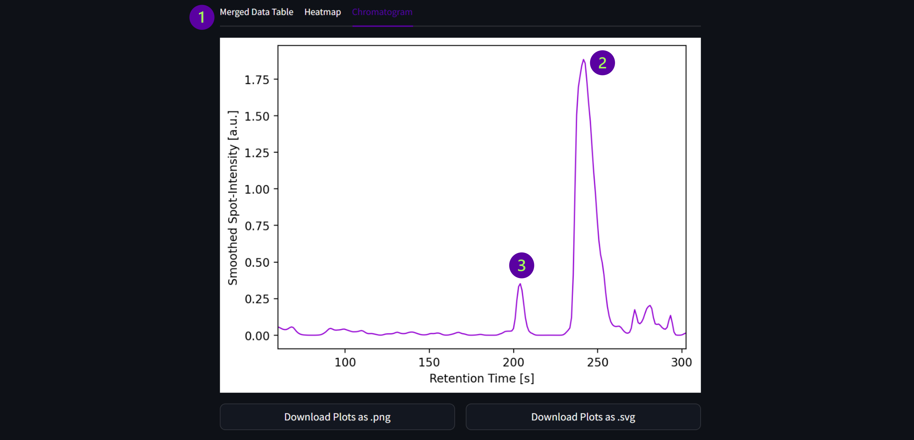

# MicroSpot-Reader WebApp user guide

***Author:*** *Simon Knoblauch*
## Introduction

The MicroSpot-Reader WebApp is a bioinformatic tool meant to assist researchers in the identification process of bioactive compounds in complex biological samples during Liquid Chromatography Mass Spectrometry (LC-MS) analysis. The tool employs an image processing algorithm to extract bioactivity data from optical biological or biochemical assays performed on LC fractions, particularly utilizing grid-based assay systems such as well plates or microfluidic devices. Subsequently, the tool constructs a bioactivity chromatogram, providing a comprehensive representation of bioactive peaks. This chromatogram is then correlated with features derived from untargeted metabolomics experiments. By integrating the bioactivity information with mass spectrometric data, the tool facilitates the precise correlation of specific m/z-values with bioactive compounds. This synergistic approach aims not only to enhance the accuracy of bioactive compound identification but also provides valuable insights into the molecular basis of bioactivity within complex biological mixtures, thereby advancing our understanding of the functional aspects of metabolomes. An example of an experimental workflow benefiting from this App is shown in Fig. 1.

***Figure 1: Basic Workflow for annotation of LC-MS features with bioactivity-data:*** *A complex sample undergoes HPLC separation. Post-column, the eluate is divided between mass spectrometric analysis and fractionation. Feature detection of mass spectrometry data provides information on m/z and retention time of compounds in the eluate. Simultaneously, the fractionation set-up deposits the sample onto a grid-based microfluidic device or well-plate. Optical biological or biochemical assays performed on the fractions then yield activity data, from which an activity chromatogram can be constructed. The activity chromatogram's peaks are then correlated with features from mass spectrometry through careful alignment of retention times and systematic peak-shape correlation.*

### Libraries used

The MicroSpot-Reader WebApp is implemented in Python 3.11 and leverages the Streamlit open-source app framework. All key libraries that have substantially contributed to the codebase are listed along with their version numbers in Tab. 1. An exhaustive list of *all* used packages and libraries can be found in the `environment.yml` file in our [GitHub repository](https://github.com/Functional-Metabolomics-Lab/MicrospotReader).

***Table 1: Python Libraries which contributed substantially to the MicroSpot-Reader WebApp codebase.***
|Library        |Version    |Citation                   
|-              |-          |-       
|Streamlit      | 1.31.1    | [Snowflake Inc.](https://streamlit.io/)
|NumPy          | 1.26.1    | [Harris *et al.*](https://doi.org/10.1038/s41586-020-2649-2)
|pandas         | 2.1.2     | [McKinney *et al.*](https://doi.org/10.25080/Majora-92bf1922-00a), [pandas development team](https://doi.org/10.5281/zenodo.10045529)
|SciPy          | 1.11.3    | [Virtanen *et al.*](https://doi.org/10.1038/s41592-019-0686-2)
|pyOpenMS       | 3.1.0     | [Röst *et al.*](https://doi.org/10.1038/nmeth.3959), [Röst *et al.*](https://doi.org/10.1002/pmic.201300246)
|scikit-image   | 0.22.0    | [Van der Walt *et al.*](https://doi.org/10.7717/peerj.453)
|Matplotlib     | 3.8.0     | [Hunter](https://doi.org/10.1109/MCSE.2007.55)
|Numba          | 0.59.0    | [Lam *et al.*](https://doi.org/10.1145/2833157.2833162)

### General Layout

The Layout of the WebApp is shown in Fig. 2, it comprises three distinct modules: (1) Image Analysis, (2) Data Preparation and Merging and (3) Feature Finding and Annotation.

1. **Image Analysis:**
The Image Analysis page is used to derive activity values for each fraction from an image of the performed activity assay. The output is a table containing information on each fractions index on the microwellplate or microfluidics device.

2. **Data Preparation and Merging:**
The Data Preparation and Merging page constructs an activity chromatogram from image analysis data. Multiple datasets from the same LC-MS run can be merged. This page associates fractions with retention time to generate the chromatogram.

3. **Feature Finding and Annotation:** 
The Feature Finding and Annotation page conducts feature detection on a centroided mzML file of the LC-MS run. The identified features are correlated with peaks in the bioactivity chromatogram via retention time matching and peak shape correlation. This process yields feature tables for each activity peak and a comprehensive LC-MS feature table.

 

***Figure 2: General Layout of the WebApp:*** *(1) Image Processing page, (2) Data Preparation and Merging page, (3) deprecated .mzML-File Annotation and (5) Display of Datasets stored in the Session.*

In addition to the web app pages, the sidebar provides information on stored session data through a table (5). Each stored dataset is labeled with its *name* and its *type*. The following data types can be stored in the session:

- **Image Data:** Contains saved datasets from image analysis.

- **Prepared Data:** Contains saved datasets from data preparation and merging.

The process for adding data will be explained in later chapters. Please be aware that session data is lost upon closing the app!

### Requirements

The application relies on two essential input files. Firstly, an optical readout of an activity assay in image format (.png, .jpg, or .tif) is necessary for image analysis. The image's color space must be either RGB (colored images) or grayscale (black and white images). The image should display circular wells or spots organized in a grid-based manner, as is the case with standard well-plates. To avoid potential artifacts during analysis, it is recommended to crop the image, focusing only on the relevant wells or spots.

In cases where multiple assays are needed to cover all fractions collected during the LC run, it is advised to either capture one image per assay or split the recorded image into multiple images containing one assay each. This approach ensures that image analysis and normalization can be conducted independently for each assay.

Oversaturation of regions in the image should be prevented, as this could distort peak shapes during subsequent analysis. In later chapters examples will be discussed, where oversaturation may not be problematic, it is however generally advisable to avoid it proactively.

<!-- TODO: Add figure for image examples here -->

The second vital input file is a centroided .mzML file containing information on the performed LC-MS run for feature detection and annotation. The file must contain data from an LC-MS run that can sensibly be correlated with the bioactivity data derived from image analysis. While using an experimental setup as described in Fig. 1 is recommended, alternatively, data from a separate LC-run conducted under identical conditions to the one executed for fraction collection can be used. For precise activity correlation it is important, that the retention times of all compounds in the two runs closely align.

## Walkthrough of the App

As mentioned in the introduction, the WebApp is comprised of three main modules: (1) Image Analysis, (2) Data preparation and merging, and (3) Feature detection and annotation. This walkthrough will explain the general workflow intended for this app using an example dataset. The examples can be found on our [GitHub repository](https://github.com/Functional-Metabolomics-Lab/MicrospotReader) in the `example_files` folder. 

In the folder you will find *two* images in `.tif` format that will be used for **image analysis**. Both of these images contain activity data of reporter gene assays from the *same* fractionation experiment. Two assays had to be performed as the imaging system used to record the images does not allow for the entirety of the microfluidic device to be imaged at once. We will therefore perform image analysis *twice* and in the following step, **data preparation and merging**, we will merge the datasets of both images to construct an activity chromatogram. Additionally the first column of the first image as well as the last column of the second image were used as control-columns to check the background signal of the assay. They were thus not used for fractionation during the LC-run. Before assigning each fraction a retention time, we will have to remove these columns from the dataset. The result of the data preparation step can also be found in the `example_files` folder with the name `activity_table.csv`. Finally we will perform feature detection using the `example_mzml.mzML` file and find possibly bioactive features within the feature table by correlating them to the bioactivity values obtained in the **feature finding and annotation** module.

This chapter will only concern itself with the user workflow of the app and keep technical details to a minimum. The algorithms used in each module as well as all settings will be explained in a separate chapter later.

### Image analysis

In this section we will focus on the *image analysis* module of the MicrospotReader WebApp. As explained above, we will perform image analysis *twice*, once with each picture in the `example_files` folder in our [GitHub repository](https://github.com/Functional-Metabolomics-Lab/MicrospotReader). Each time we will focus on a different aspect of the module. To start image analysis please navigate to the *"Image Analysis"* page by selecting it in the top left corner.

### Example Part 1: Simple workflow

Once you have navigated to the *"Image Analysis"* page, you will be asked to upload an image using the drag and drop field (2) provided. In this example we will instead be using the provided dropdown menu (1) to select ***"Example Part 1"***. The selected or uploaded image should now be displayed in grayscale using the *viridis* colormap.

Below the displayed image you will find the settings that can be changed for image analysis. Most of the settings are hidden inside expandable menus organized by the step of image analysis that they influence. Depending on the measurement setup used by you, it may be critical to change some of these parameters. In a later chapter we will go through how to change these settings. Since the settings of the WebApp are optimized for our measurement set up, none of the "hidden" settings will have to be changed. 

You are however prompted to enter the indices of the first (1) and last spot (2). We refer to each individual fraction that has been fractionated onto our microfluidic device as a ***spot***. The *"First Spot"* refers to the top-left most spot visible in the image, while the *"Last Spot"* refers to the bottom-right most spot visible in the image. Indices should be provided as `<LETTER><NUMBER>`, where the letter (from A-Z) indicates the *row-index* and the number indicates the *column-index*, similarly to microwellplates. In the case of this example the index of the first spot would be **A1** and the index of the last spot would be **L11**. We can now press the ***"Start Analysis"*** button to initiate analysis.
   

Once analysis has concluded, results will be displayed in 3 tabs below the *"Start Analysis"* button: (1) "Image", (2) "Table" and (3) "Heatmap".

*(1) The resulting Image:* The first tab *"Image"* of the *Results-View* shows the analyzed image overlaid with some of the extracted information:

1. All spots detected during initial spot detection (shown in black)
2. All spots backfilled during spot correction (shown in red)
3. The row and column indices of the spots

This view allows you to check for any mistakes made during image analysis, like missing rows or columns, correct detection of all spots and correct row and column indexing as well as providing a nice overview of what the algorithm has detected.

*(2) The Data Table:* The data table is the most important piece of information obtained by image analysis. It contains the indices and activity values for each spot detected by the algorithm. This table is used in the *data preparation and merging* step, at which point each spot will be assigned a retention time based on their indices. This information can then be used to construct a bioactivity chromatogram. By hovering over the table and finding the download button on the top left of the table, you can save the results of this step to your computer.

The following table provides a comprehensive overview of the data saved in the table provided by the image analysis page:

| Name          | Description
| ---           | ---
| *Unnamed*     |  row-index of the table.
| *row*         |  numeric index of the row a specific spot belongs to.
| *row_name*    |  alphabetic index of the row a specific spot belongs to.
| *column*      |  numeric index of the column a specific spot belongs to.
| *type*        |  type of the spot, currently not in use. 
| *x_coord*     |  x-coordinate of the center of a spot.
| *y_coord*     |  y-coordinate of the center of a spot. Note that for images, the higher the y-value, the lower the spot is in the image.
| *radius*      |  radius of the detected spot in pixels.
| *halo_radius* |  radius of the halo surrounding a particular spot in pixels. If no halo was detected, this field is empty.
| *spot_intensity* |  spot intensity value used for further processing steps. At this stage it displays the raw_int column normalized by the median spot intensity.
| *raw_int*     |  raw intensity of a spot defined as the mean intensity of pixels within the spot.
| *note*        | Shows at which stage a particular spot was detected. Currently either "Initial Detection" if a spot was detected during initial spot detection or "Backfilled" if a spot was backfilled during spot-correction.

*(3) The Heatmap:* The *"Heatmap*" tab, fittingly, displays a heatmap of all spot-intensities found in the image. It provides a visual overview of the results by the image analysis module, that is complementary to the plot shown in the *"Image"* tab. Both plots can be saved with some additional information in `.png` (1) or `.svg` (2) format using the two buttons  provided below the results tabs.

After inspecting and downloading your results, you can save them in the current session. This facilitates data handling, as you do not have to upload the downloaded datatable for each consecutive step. To save your data to the current session, navigate to the sidebar, enter a unique name for your dataset (1) and press the *"Add current Data to Session"* button. The data will then be displayed in the sidebar. All datasets added during the image analysis step will be labeled with the type *"Image Data"*. The name of the set can still be changed after adding it to the session, by double-clicking its name in the "Name" column, choosing a new name and then pressing the *"Apply Changes"* button. If you want to delete a saved dataset, please select it by ticking the box in the "Select" column and then pressing the *"Delete Selection"* button.

After saving your results, you can safely continue with the analysis of other images or with the *"data preparation and merging"* step. In our case we will continue with the analysis of our second example image called *"Example Part 2"* by scrolling the the top of the page and selecting it in the first dropdown menu mentioned.

### Example Part 2: Halo detection

If we inspect the second image, we will find a section of high bioactivity in the bottom third of the picture indicated by high grayscale values. At this point it may be of importance to mention, that the bioactivity assay performed in this example was a reporter gene assay. The reporter gene used induces a luminescent signal upon cellular stress. Bacteria on spots with a high luminescent signal are therefore likely under higher cellular stress compared to spots with low luminescent signal. This can be correlated with antimicrobial activity of the fraction that was fractionated onto that specific spot. High antimicrobial activity can lead to an inhibition zone around the center of the spot. This leads to antimicrobial halos being visible in the image. Some spots on the example image do show antimicrobial halos, they are characterized by a ring around the the spot with higher luminescent intensities compared to the center. In these cases, the intensity values of the spots do not correlate well with the actual bioactivity of the fraction. This is why, in these cases, we perform an additional step during image analysis called *"Halo Detection"*. During this step, halos and their radii are detected within the image to extract semi-quantitative information from these spots. 

After selecting *"Example Part 2"* we again have to enter the indices of the first and last spot. As we are now dealing with the second half of the microfluidics device, the first index will be **A12** and the last index will be **L22**. Before pressing the *"Start Analysis"* button however, we will now enable the halo detection step in the settings. We do this by navigating to the settings tab called *"Halo detection"* and activating the *"Enable Halo detection"* (1) and *"Scale Halo radii to Spot intensity"* (2) settings. This second setting is important to include information extracted by halo detection in the chromatogram construction step. How this works in detail is explained in the chapter explaining the algorithm. After enabling these two settings you can go ahead and start the analysis.

If we now inspect the results, we can see that not all halos could be detected within the image. Specifically *I20* and *J20* have wrongfully not been assigned a halo radius. This is because the algorithm used for halo detection is not as robust as the spot detection algorithm and therefore is more prone to errors. We can now backfill the missing halo radii through interpolation using the neighboring spots. The simplest method for this is a linear interpolation, where we take the mean of the halo radii of the spots located before and after the current spot. For I20 this would result in a halo radius of 71 and for J20 in a halo radius of 68. We can now manually input these values in the data table for the two corresponding spots (1). By pressing the *"Update Dataset"* (2) button the dataset will then be updated to correctly include the interpolated values. If you now inspect the results tabs again, you will see that both I20 and J20 are labeled with a halo radius.

Similarly if a spot has been wrongfully assigned a halo radius, you can remove the false positive by deleting the corresponding halo radius in the datatable and then pressing the *"Update Dataset"* button.

After inspecting your results, you can again add the dataset to the current session and proceed to the next step.

### Data preparation and merging

In this section we will focus on the *data preparation and merging* module of the WebApp. For this we will use the two datasets analyzed in the previous chapter. As explained there, the microfluidic-device had to be split in two to perform the activity assay. We will therefore first merge the two datasets, then assign a retention time to each detected spot and finally create a bioactivity chromatogram from the data. The prepared dataset can then be used in the final module, *"Feature finding and annotation"*, to correlate peaks in the activity chromatogram with features from the LC-MS run.

To start, please navigate to the *"Data Preparation"* tab in the WebApp. Here you will find a dropdown-menu at the top of the page. We can either choose to upload one or more datasets that we downloaded during *image analysis* (2) or use a selection of datasets from our session storage (1). As we stored our datasets in the session, we will choose *"Use Selection in current Session"*

If you chose to use data stored in the session, you will have to select the appropriate datasets from the session storage. To do this, tick the boxes of the desired datasets in the *"Select"* column of the table displayed in the sidebar of the WebApp (1). The data will not yet be fully selected as indicated by the *"Changes have not been applied yet!"* warning displayed in yellow. To apply the data, press the *"Apply Changes"* button (2) below the table. You should now see a list of all selected datasets as well as the already ***merged*** data table below the dropdown menu. Please inspect the table to make sure no mistakes were made. The datasets are merged based on the indices of the spots. If these are incorrectly assigned, the merged dataset may not be correct.

After merging the datasets, we will assign a retention time to each spot and create an activity chromatogram. To do this navigate to the box below the table of the merged data. As mentioned in the previous chapter, column 1 and column 22 of the microfluidic device were not used for fractionation during the LC-run. We therefore no longer need these columns and can remove them. This is done by selecting the indices of the columns we want to remove in the *"Remove Columns"* dropdown menu (1). Please select column 1 and column 22 here. Analogously you can also remove rows from the dataset with the *"Remove Rows"* setting. We will however not do that here. 

To correctly assign a retention time to each spot, the WebApp needs to know the start and end-time of fractionation relative to the LC-MS run. You can input these values in the fields for *"Start Time [s]"* (2) and *"End Time [s]"* (3). In our case, we started fractionation at 60 s and finished at 302.4 s. Since the fractionation is done with a serpentine path (odd rows are spotted in an increasing manner and even rows in a decreasing manner), we also enable the *"Serpentine Path"* (4) setting. Finally we can start the preparation of the activity data by pressing the *"Start Data Preparation"* button (5).

You will now find the results from data preparation below the settings-box. As with the results-display in the *image analysis* module, you can click through the different visualizations (1). The merged data table is analogous to the tabular data from *image analysis*, the spots are now however sorted in a serpentine manner (if the setting is enabled). Additionally a new column appeared at the end of the table: *"RT"*. This column holds the retention time of each spot in seconds.

The heatmap is again similar to the one found in the *image analysis* module. In the merged heatmap you can now clearly see a single intense bioactive peak spanning rows I and J. We can also observe this peak in the chromatogram (2). Interestingly, an additional peak can be seen around 200 s (3). This peak does not appear within the heatmap. We refer to these peaks as *satellite peaks*. They appear because of the close spacial proximity of row H spots to the intensely bioactive spots of row I. The bioactivity signal of row I "radiates" outwards and leads to higher than normal intensity values in neighboring rows. This is an important observation that we will come back to in the last module *"Feature finding and annotation"*.

Once you are happy with the results of the *data preparation and merging* step, you can again download all plots in `.svg` or `.png` format using the buttons below the results, download the prepared dataset in tabular form by pressing the download button on the top left of the table and store the data in the session by giving it a name and pressing the *"Add current Data to Session"* button. All data saved during this step of the workflow will be given the Type *"Prepared Data"*. You can now safely continue analyzing more data or starting the *feature finding and annotation* step.

### Feature finding and annotation

This module is the final step in the activity correlation workflow. Here, we will perform feature detection on an `.mzML` file from the LC-MS run performed in parallel to the fractionation and correlate features to the peak of the activity chromatogram that we observed in the *data preparation and merging* step. To start, please navigate to the *"Feature Finding and Annotation"* page in the WebApp.

We will start by selecting the prepared dataset we want to use for correlation. You can again choose to upload a dataset or use one selected from the ones stored in the session (1). The process of choosing a dataset from the session storage is the same compared to the last chapter. Note that only datasets of type *"Prepared Data"* will be considered for this step. After selecting the correct dataset you can choose to upload a `.mzML` file or use the example provided for this walkthrough (2). We will choose to work with the example file. 

Next we check the settings to make sure they are set correctly. A description of all settings as well as advice on how to set them will be discussed in a separate chapter. The two most important settings for correlation of activity data to the features of the `.mzML` file are the *"Retention Time tolerance"* (1) and the *"Retention Time offset"* (2). If you run you own experiment it is quite important to quantify the retention time offset your activity data has compared to the LC-MS data. For our experimental setup the offset is roughly 4 s, meaning that *the activity peak elutes 4s earlier than its corresponding MS feature*. The tolerance can be set arbitrarily, the larger it is, the higher the number of features will be that can be correlated with the activity peak.

Once you are sure you are using the correct settings, press the *"Start Feature Detection and Annotation"* button (3) to commence analysis.

Once feature detection and correlation to activity values has finished, you will be shown the results. These are split into two sections (1): *"Activity peak data"* and *"Annotated Feature Tables"*. On the *activity peak data* tab the results of peak finding in the activity chromatogram are displayed in tabular form (2) as well as in a 1D chromatogram and a 2D heatmap. Please note that peaks are labeled in order of intensity starting with the most intense peak. As we discussed in the previous chapter, a satellite peak (3) can be seen in the 1D chromatogram. This satellite however was not recognized as an active peak. The algorithm used for peak detection uses the 2D heatmap instead of the 1D chromatogram to ensure that satellites are not falsely labeled as bioactive peaks. The details of this are explained in a separate chapter talking about the algorithm.

On the second tab, *"Annotated Feature Tables"* you will find one feature table for *each* detected peak in the activity chromatogram. This table will contain all features that fall into the time frame defined in the settings *and* show a significant similarity in shape. The shape similarity is quantified via pearson correlation and significance is assigned at a correlation coefficient of 0.8 or higher. The value is displayed in the last column of the feature table.

Additionally, you will find a plot containing the activity peak overlapped with each correlated feature. This can be used for visual inspection to help pick out the most interesting features. The individual overlaps are plotted in an increasing manner regarding the correlation coefficient.

Once you are happy with the results, you can once again download all plots in `.svg` or `.png` format using the buttons below the results, download all feature tables using the download buttons on the top left of each table and download the results from feature finding for *feature based molecular networking* with GNPS2 using the *"Download Files for FBMN"* button above the results.

## Description of the Algorithm

In this chapter, the algorithms used for each module of the WebApp are explained in more detail.

### Image Analysis
The initial page of the MicroSpot Reader WebApp focuses on the detection and densitometric analysis of circular spots or wells arranged in a grid-based pattern, from now on referred to as spots. The image analysis module is subdivided into six key steps, each illustrated in Figure 3.

***Figure 3: Results of each step of the image analysis workflow:*** *Spots are represented as black circles. Bioactivity is represented with green color. The antimicrobial halo is represented as a light-green circle replacing the black border of a typical spot. (A) Image preparation: a grayscale version of the uploaded image, (B) Initial spot detection: Initially detected spots with artifacts, (C) Grid detection: part of spot correction, overlays a regular grid on top of the image, (D) Spot correction: removal of artifacts and backfilling of missing spots (E) Halo detection: Optional step, detects the radius of antimicrobial halos in the image, (F) Indexing and activity determination: Labeling of each spot with a unique index and an activity value, (G) Further downstream processing*

**Image Preparation (A):**
In the first step, the image undergoes lightweight preprocessing, converting it to grayscale. Optionally, inversion is applied.

**Initial Spot Detection (B):**
This step employs histogram equalization and Canny edge detection on a copy of the image, producing a one-pixel-wide edge representation of the image. In this step a gaussian filter is applied to smooth out noise in the image. A circle detection by hough transform is then used to identify spots within a defined range of radii. The number of spots detected will at maximum be equal to the amount of spots expected in the image. The locations where spots can be detected are constrained by a user-specified minimum distance. In some cases not all spots within the image will be detected correctly during initial spot detection. This results in the presence of artifacts that need to be removed.

**Spot Correction (C+D):**
Spot correction involves two steps. Initially, a grid is derived from all detected spots using linear Hough transform and peak detection to identify horizontal and vertical lines. The minimum distance between gridlines can be constrained. Vertical lines are allowed an angle of $90° \pm tolerance$, while horizontal lines are allowed an angle of $0° \pm tolerance$. The tolerance is user specified but defaults to $5°$. Intersections of gridlines establish the predicted locations of spots. Detected spots are validated against the grid by setting a maximum distance spots can have from intersections. Any artifacts are removed. Missing spots are backfilled and marked as such. 

***Optional*** **Halo Detection (E):**
In reporter gene assays conducted within spot-based microfluidic devices (as described in Fig. 1), instances may arise where the activity of spotted fractions leads to cell death at the center of the spot. An antimicrobial halo is formed (Fig. 4). In such cases, relying on the densitometric analysis of the spot is not recommended due to reduced signal intensity in these regions. In these cases measuring the size of the antimicrobial halo becomes interesting to still yield information on bioactivity of the fraction associated with the halo. To facilitate this analysis, an optional module has been implemented, referred to as *"halo detection"*.

***Figure 4: Close-up of antimicrobial halos in a reportergene assay.***

During halo detection, circular features of high intensity are extracted from the image using morphological reconstruction, thresholding using otsu's method and skeletonization. On the result circle detection using a hough transform is performed analogously to initial spot detection. Again, the range of tested radii and the minimum distance halos can have to each other is user specified. Detected halos are then linked to their respective spots through proximity. To increase robustness of halo detection, small features of high intensity are removed and the skeleton of the halos is increased in width prior to circle detection.

Spots associated with an antimicrobial halo will have an additional property called `halo` that contains the radius of their antimicrobial halo. 

**Index Assignment and Activity Determination (F):** After spot detection, spots are not sorted by location but rather by their output value from circle detection. In order to assign each spot and therefore each fraction their correct retention time, each spot is assigned an index based on their coordinates in the image. The starting index (top left spot in the image) and the last index (bottom right spot in the image) have to be user specified at the start. Rows are indexed by letters ranging from A-Z, columns are indexed using numbers.

After index assignment, the mean pixel value of each spot (called `spot intensity`) is determined. The area of the image used for this purpose is defined by the coordinates of the center of the circle as well as a user specified disk-radius. By default the radius determined during initial spot detection is used. For spots backfilled during spot correction the mean radius of spots is used. The spot intensity is then used as a measure for bioactivity of the spots fraction.

In order to be able to compare multiple images, each spot is normalized by dividing all spot intensities by the median spot intensity of the data set. 

For datasets in which antimicrobial halos are present, the algorithm offers the option to replace the spot intensity of spots containing halos (or only the normalized intensity) with the halo-radius scaled to the intensity values. The factor for scaling is currently chosen arbitrarily and can be set by the user. Semi-quantitative statements on the data can then still be made.

**Further Steps (G):** Determination of the spot intensity is the last step of image analysis. After image analysis  datasets containing data on the same experiment can be merged, a retention time is then associated with each spot in the data set and an activity chromatogram is constructed.

### Data preparation and merging

The Algorithm for this module of the MicrospotReader is fairly simple. First all tables selected for data preparation are concatenated. The spots are then sorted by row and column index. If a serpentine path was selected, spots are first sorted by row. Odd rows are additionally sorted by increasing column index, while even rows are sorted by decreasing column index. If the "Serpentine Path" setting was disabled all rows are sorted by an increasing column index.

Using the specified start and end times of spotting, each spot in the sorted list is then assigned a unique retention time. This is done by calculating a series of time points with equal spacing, defined by the number of spots in the merged table. 

To smooth out the chromatogram, a one dimensional gaussian filter is then passed over the spot intensity values using a user specified sigma value.

### Feature finding and annotation

The algorithm for this module is split into three parts: (1) Feature finding, (2) Activity peak detection and (3) Correlation of features with activity peaks.

**(1) Feature Finding:**
The feature finding algorithm is implemented using pyOpenMS and based on the example algorithms published by the pyOpenMS team in the Documentation: [Untargeted Metabolomics Preprocessing](https://pyopenms.readthedocs.io/en/latest/user_guide/untargeted_metabolomics_preprocessing.html), [Feature Detection](https://pyopenms.readthedocs.io/en/latest/user_guide/feature_detection.html), [Adduct Detection](https://pyopenms.readthedocs.io/en/latest/user_guide/adduct_detection.html) and [Export Files for GNPS](https://pyopenms.readthedocs.io/en/latest/user_guide/export_files_GNPS.html). The order within which these algorithms are implemented is as follows:

1. Feature Detection
2. Mapping MS2 data to Features
3. Adduct detection
4. Exporting files for GNPS

The feature traces acquired in these steps are then used in later steps for correlation with activity data

**(2) Activity peak detection:**
As discussed in previous chapters, highly bioactive peaks may "radiate" outwards and lead to satellite activity peaks. These do not correlate to a bioactive fraction within the spots. In order to avoid detecting satellite peaks, peak detection is done on the heatmap of the activity data. Here a topological local maximum peak detection algorithm from scikit image is used. The threshold for peak detection is either input manually by the user or determined via an algorithm that systematically removes "outliers" from the chromatogram until the baseline of the chromatogram is found. Then standard deviation and mean are calculated of the baseline. The threshold is defined as the mean plus three standard deviations. 

In order to find the start and end points of each detected peak, all local minima are detected within the 1D chromatogram. For each peak the closest minima to the left is considered its starting point and the closest minima to the right is considered its end point.

Finally the AUC of each peak is determined using the peaks start and endpoint.

**(3) Correlation of features with activity peaks:**
Feature correlation is a two step process: Features with retention times (RT) similar to peaks in the activity chromatogram are selected as potential candidates. During this step the user can select a tolerance $T$ and an offset $\Delta RT$ for candidate selection. The search window is defined as: $(RT_{activity} + \Delta RT) \pm T$.

Shapes of candidate features are then correlated with the shape of the activity peak via pearson correlation. As only the shape and not the amplitude of the signal are supposed to be correlated, both, the feature traces and the activity peak trace, are normalized by setting the maximums to 1. The sampling frequency, start and end points of activity peak and feature candidates are not the same. Pearson correlation requires that all of these values match. Therefore for each feature candidate - activity peak pair, common bounds are derived and interpolated chromatograms are created from both traces with a matching sampling frequency. 

To find common bounds, first the retention times of both the activity peak trace and the feature traces are subtracted by the retention time of their maximum respectively to center the maximum on 0. The common start value is then the start value of the trace closer to the peak maximum. Analogously the common end value is the end value of the trace closer to the peak maximum. Using the common bounds and the higher sampling frequency of the two traces, a common series of retention times is calculated. Interpolated chromatograms are then created for both the activity peak and feature trace by linear interpolation of the common retention times using the original traces as a map. Finally the pearson correlation coefficient between the interpolated chromatograms is determined. Features with a correlation coefficient greater than 0.8 are assigned to their activity peak. The signal preprocessing steps are visualized in Figure 5.

 **Figure 5: Preprocessing of signals for pearson correlation:** (A) Determination of common bounds between the two time series, (B) Different sampling frequencies of the two time series and (C) Common sampling frequency and bounds of the interpolated chromatograms.

## Settings and Advice

In this chapter, all settings that the user can change are described. Additionally some advice is given on how to determine an appropriate value for each setting in case a setup is used that differs from the one in our lab. 

### Image Analysis

#### General

| Setting                | Description  | Advice
| ---                    | ---          | ---
| Invert grayscale Image | Inverts values of the grayscale Image | Active fractions should show higher pixel values than inactive ones. In some cases images are inverted by the measurement device or a higher activity leads to loss of signal. In these cases use this setting to obtain better results.
| Index of First Spot    | Index of the top- and left-most spot visible in the Image | An example is `A1`, where "A" is the row-index and "1" is the column index. Row indices are always given as a single letter in the range A-Z while column indexes can be any positive integer value. Note that "Z" is the last possible row-index, the first spot can only have "Z" as a row-index if there is only one row visible in the image.
|Index of Last Spot      | Index of the bottom- and right-most spot visible in the image | An example is `L20`, where "L" is the row-index and "20" is the column index. Row indices are always given as a single letter in the range A-Z while column indexes can be any positive integer value. Note that the row and column indices of the last spot must always be *higher* than that of the first spot.

#### Spot detection

These settings are highly dependent on the experimental setup that is used and the resolution of the recorded image. If the setup used to record the image is different from the one used here, is ***very important*** to change these settings to fit the experimental setup. The image analysis algorithm will not work properly if these settings do not match the image. For each setting advice is given on how to find a fitting value. Finding these Settings ideally only has to be done once for a given experimental setup as the resolution of the image and the size of spots should not vary between experiments.

It is recommended to measure the size and distance between spots (in pixels) using a graphics editor like Microsoft Paint. These programs generally show the current location of your cursor within the image (Fig. 5). This feature can be used to quickly and easily estimate the radius and distance between spots.

 

***Figure 5: Using MS-Paint to measure your Image:*** *Highlighted in the red box is the feature displaying the location of your cursor within the image. Using this the radius and distance between spots can easily be estimated.*

| Setting                | Description  | Advice
| ---                    | ---          | ---
| Smallest tested radius | The smallest radius (in pixels) that a spot is allowed to have to be considered during spot detection | In order to measure the radius of spots in the image, use the method described above and place your cursor in the center of a spot. Note down the position of your cursor and move to the edge of the spot either in x or y direction. Calculate the difference in the respective direction, this is the spot radius in pixels. The algorithm generally underestimates the radius of spots so the smallest tested radius should be around 10 pixels smaller than the determined value. 
| Largest tested radius | The largest radius (in pixels) that a spot is allowed to have to be considered during spot detection | In order to measure the radius of spots in the image, use the method described above and place your cursor in the center of a spot. Note down the position of your cursor and move to the edge of the spot either in x or y direction. Calculate the difference in the respective direction, this is the spot radius in pixels. The largest tested radius should be slightly higher than the determined radius.
| Minimum x-distance between spots | The minimum distance in x-dimension spots need to have | In order to find the distance between spots, use the method described above and place your cursor in the center of a spot. Note down the position of your cursor and move to the center of the next spot in x-dimension (left to right). Calculate the difference in the x-dimension, this is the distance between spots. The minimum x-distance should be slightly lower than the determined distance. If not all columns are detected during image analysis, it is recommended to lower this value.
| Minimum y-distance between spots | The minimum distance in y-dimension spots need to have | In order to find the distance between spots, use the method described above and place your cursor in the center of a spot. Note down the position of your cursor and move to the center of the next spot in y-dimension (top to bottom). Calculate the difference in the y-dimension, this is the distance between spots. The minimum y-distance should be slightly lower than the determined distance. If not all rows are detected during image analysis, it is recommended to lower this value.

#### Spot correction

These settings are highly dependent on the experimental setup that is used and the resolution of the recorded image. If the setup used to record the image is different from the one used here, is ***very important*** to change these settings to fit the experimental setup. The image analysis algorithm will not work properly if these settings do not match the image. For each setting advice is given on how to find a fitting value.

| Setting                | Description  | Advice
| ---                    | ---          | ---
| Minimum distance between grid-points | Minimum distance (in pixels) the grid-points and therefore grid-lines are allowed to have | This value should be similar to the minimum distance spots are allowed to have. To increase robustness, a slightly higher value can be used. The value should however not be larger than the measured distance between spots.
| Max. spot distance from grid-points | Distance (in pixels) initially detected spots are allowed to have from points on the grid to be considered "correct" | This value is dependent on the size of spots. Generally half to one-third of the spot radius is recommended as a starting point. If you find that too many spots are being backfilled, increase the tolerance. If many inaccurate spots are still present after correction, lower the tolerance.

#### Halo detection

Halo detection is an optional step, only required if antimicrobial halos are visible within the image. It is then used to detect and assign the halos to a spot and determine their radius. Halo detection is very sensitive to changes in image quality and used settings. It is also the least robust step during image analysis. Care needs to be taken when selecting the settings.

These settings are highly dependent on the experimental setup that is used and the resolution of the recorded image. If the setup used to record the image is different from the one used here, is ***important*** to change these settings to fit the experimental setup. The image analysis algorithm will not work properly if these settings do not match the image. For each setting advice is given on how to find a fitting value.

| Setting                | Description  | Advice
| ---                    | ---          | ---
| Enable Halo detection  | Enables optional halo detection | Only enable this setting if there are antimicrobial halos visible in the image.
| Smallest tested radius | Smallest radius (in pixels) that a halo is allowed to have | It is recommended to keep this setting higher than the largest tested spot radius. Using lower radii might lead to an increase in false-positives. The bigger the difference between the lowest and highest tested radius, the longer halo detection will take.
| Largest tested radius | Largest radius (in pixels) that a halo is allowed to have | This setting hast to have a higher value than the smallest tested radius. The exact value depends on the expected sizes of halos. The bigger the difference between the lowest and highest tested radius, the longer halo detection will take.
| Minimum x-distance between halos | The minimum distance two halos need to have from each other in x-direction | It is usually recommended to use the same distance as for spot detection. Halo detection can be more robust if this setting takes on lower values than the spot-counterpart. Some experimentation might be needed here.
| Minimum y-distance between halos | The minimum distance two halos need to have from each other in y-direction | It is usually recommended to use the same distance as for spot detection. Halo detection can be more robust if this setting takes on lower values than the spot-counterpart. Some experimentation might be needed here.
| Scale Halo radii to Spot Intensity | Option to replace the spot intensity of a spot with a scaled down version of the halo radius | As the spot intensity is lower than expected for spots associated with a halo, the value can be replaced with a scaled down version of the halo-radius as a means to yield at least semi-quantitative data for construction of an activity chromatogram. This setting is used in conjunction with *"Scaling Factor"*.
| Scaling Factor | Value to be used for scaling | Used in conjunction with *"Scale Halo radii to Spot Intensity"*. Arbitrary value that the halo radius is multiplied by to yield a value more in line with spot intensities. For the method used in our lab 0.04 was found to be appropriate.

#### Advanced Settings

These settings are likely not changed by the user but are included in the app for the sake of completeness.

*Initial Spot-Detection:*
| Setting                | Description  | Advice
| ---                    | ---          | ---
| Sigma-value for gaussian blur | Sigma value used for the smoothing step during edge detection | The higher this value is the lower the thresholds for edge-detection have to be in order to yield a good result. 10 was found to yield the most robust result in our case. If changed at all, it's probably best to lower it. The smoothing step is responsible for the underestimation of spot radii during spot detection. The lower the sigma-value the better the radius estimation becomes, but the less robust spot detection is for noisy data.
| Edge-detection low threshold | Lower threshold for canny edge detection | It is required by the algorithm that this value is ***lower*** than that of *"Edge-detection high threshold"*. If the sigma-value is changed, this setting most likely will also have to be changed. Here some experimenting will be necessary. It is recommended to use the jupyter-notebooks for this instead. 
| Edge-detection high threshold | Higher threshold for canny edge detection | It is required by the algorithm that this value is ***higher*** than that of *"Edge-detection low threshold"*. If the sigma-value is changed, this setting most likely will also have to be changed. Here some experimenting will be necessary. It is recommended to use the jupyter-notebooks for this instead. 
| Spot-detection threshold | Fraction of highest signal in hough-transform that is still considered a circle | Can take values between 0 and 1. The lower this value the less selective spot detection becomes, the higher this value the less sensitive spot detection becomes. If changed at all, it is recommended to use the jupyter-notebooks to determine a new setting.

*Grid-Detection:*
| Setting                | Description  | Advice
| ---                    | ---          | ---
| Maximum tilt of grid | Allowed tilt (in degrees) of the microfluidics device or wellplate in the image | Restricts the angle that grid-lines are allowed to have. Allows for tolerance during positioning of the sample below the camera. The lower this value is, the more robust grid detection becomes but the lower the tolerance for positioning of the assay.
| Threshold for line-detection | Fraction of highest signal in hough-transform that is still considered a line | Can take values between 0 and 1. The lower this value the less selective grid-detection becomes, the higher this value the less sensitive grid-detection becomes. If changed at all, it is recommended to use the jupyter-notebooks to determine a new setting.

*Spot Correction and Intensity Evaluation:*
| Setting                | Description  | Advice
| ---                    | ---          | ---
| Normalize Spot intensities by median value | Divides each spot intensity by the median raw spot intensity of the dataset as a means for normalization. | It is highly recommended to keep this setting enabled. If you prefer to not use a normalization method or want to normalize the values using a custom method on the downloaded data table, you can disable this setting.
| Disk-radius for spot intensity calculation | Radius (in pixels) of the disk used for the determination of spot intensity | The mean of values of all pixels within this disk is calculated. When `0`, the determined radius of each spot is used. For any positive integer the selected radius is used instead.

*Halo-Detection:*
| Setting                | Description  | Advice
| ---                    | ---          | ---
| Halo-detection threshold | Fraction of highest signal in hough-transform that is still considered a halo | Can take values between 0 and 1. The lower this value the less selective halo-detection becomes, the higher this value the less sensitive halo-detection becomes. If changed at all, it is recommended to use the jupyter-notebooks to determine a new setting.
| Minimum Object Size | Minimum size of objects (in pixels) that is allowed during halo detection | During the process of halo detection after thresholding of the image, small objects are removed to allow for proper skeletonization of the created mask. The minimum object size defines the smallest object size allowed during this step.
| Disk radius for morphological dilation | Kernel used for morphological dilation after skeletonization of the mask during halo detection | The skeleton of the halos is dilated to yield a more robust circle detection. The bigger the disk during this step, the wider the skeleton becomes. A wider skeleton leads to lower accuracy during radius determination but may help increase sensitivity for circle detection in the first place. A value of 10 is a reasonable value for higher sensitivity, if the accuracy of radii is more important we suggest a value of 3.

### Data preparation and merging

|Setting|Description|Advice|
|---|---|---|
|Remove Rows|Select Rows to remove from the dataset|Any rows selected will be removed. Use this if there are any rows that have not been used during fractionation. Note that if *"serpentine path"* is enabled, the algorithm will still sort all even rows descendingly and all odd rows ascendingly even if a row has been removed. The indexes of all non modified rows will stay the same.|
|Remove Columns|Select Columns to remove from the dataset|Any columns selected will be removed. Use this if there are any columns that have not been used during fractionation.|
|Serpentine Path|Defines the method used for sorting spots in the merged datatable. If enabled, sort spots in odd rows by increasing column index and spots in even rows by decreasing column index. If disabled, sort spots in all rows by increasing column index|Most fractionation hardware use a serpentine path for fractionation.|
|Start Time [s]|Retention time in seconds at which fractionation was started.|This needs to be accurate for the downstream correlation with features from the LC-MS run. Any error here might lead to missing the desired feature.|
|End Time [s]|Retention time in seconds at which fractionation was stopped|This needs to be accurate for the downstream correlation with features from the LC-MS run. Any error here might lead to missing the desired feature.|
|Perform Chromatogram-Smoothing|Choose whether to smooth the activity values of the chromatogram|It is recommended to use this setting as noisy data can lead to mistakes during peak detection. This setting is used in conjunction with *"Sigma-Value for gaussian smoothing"*|
|Sigma-Value for gaussian smoothing|Sigma-value of the 1d gaussian kernel passing over the activity data for smoothing.|The bigger the value, the stronger the effect of smoothing. It is not advised to increase the sigma value past 1 as the shape of peaks will be changed more strongly. This will later on lead to worse performance of the peak-shape correlation between MS-Features and the activity data.|

### Feature finding and annotation

|Setting| Description | Advice
|-|-|-
|Mass error for feature detection *[in ppm]* | Mass error in ppm that is used for feature detection using the algorithm by pyOpenMS| Set this to the mass accuracy that your instrument has
|Noise Threshold for feature detection | Features below this threshold will be considered noise and removed | Highly data dependent setting. We suggest you start with 10e5 and modify from there as needed.
|Min. fwhm of peaks during feature detection *[in s]*| Features with a lower *full width at half maximum* will be considered noise and removed| Minimum length of a feature to be considered a feature. Change this depending on the length of features you expect.
|Max. fwhm of peaks during feature detection *[in s]*|Features with a higher *full width at half maximum* will be considered noise and removed| Maximum length of a feature to be considered a feature. Change this depending on the length of features you expect.
|Retention time tolerance *[in s]*| Time window within which to correlate features to an activity peak. Window is defined as +- the set tolerance | This can be set to an arbitrary value. The higher the tolerance, the higher the number of features that will be correlated with the activity peak. Being too restrictive might lead to exclusion of the desired feature. We found 1 s to be sufficiently large for correlation.
|Retention time offset *[in s]*| Offset of retention time between LC-MS features and peaks in the activity chromatogram. The offset will be added to the RT of the activity peak to search for features.| This should be experimentally determined via spiking of a sample with a compound of known activity.
|Automatic peak threshold determination for activity Data|Enables an algorithm to automatically determine a noise threshold for peak detection in the activity chromatogram|Turn this off if the automatic threshold determination does not yield appropriate results for peak detection in the activity chromatogram|
|Manual Threshold activity data peak detection|Sets a manual threshold for peak detection in the activity chromatogram.| Highly data dependent, may require some experimentation to find a fitting value.